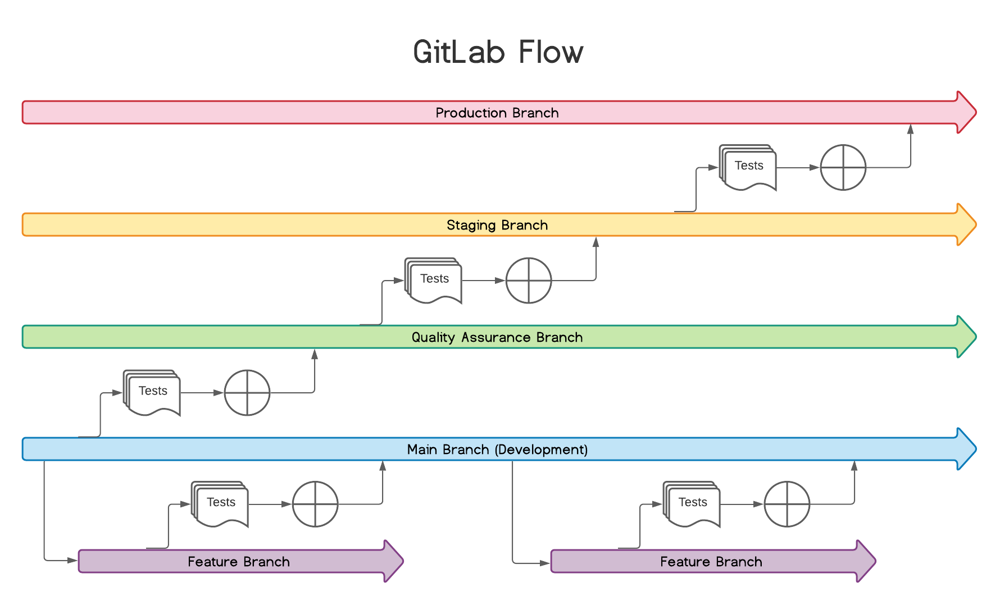
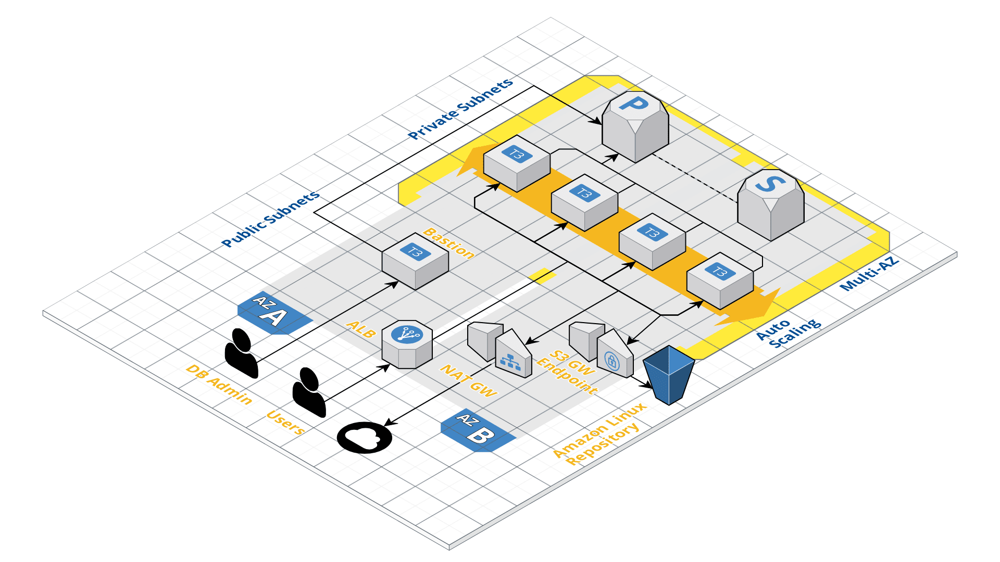

# Welcome to your Bootcamp SRE Capstone Project

Remember that you can find the complete instructions for this project **[here](https://classroom.google.com/w/MzgwNTc4MDgwMjAw/t/all)**.

If you have any questions, feel free to contact your mentor or one of us: Juan Barbosa, Laura Mata, or Francisco Bueno. We are here to support you.

## Project Diagram



## Branching Strategy




## Docker image

```shell
docker build -t davidsol/academy-sre-bootcamp-david-sol:latest .
```

## Execute docker

```shell
docker run -it --rm -p 8000:8000/tcp --name sre-app davidsol/academy-sre-bootcamp-david-sol:latest
```

## Publish to docker

```shell
docker push davidsol/academy-sre-bootcamp-david-sol:latest
```

## Set environment variables

```shell
source .env
```
